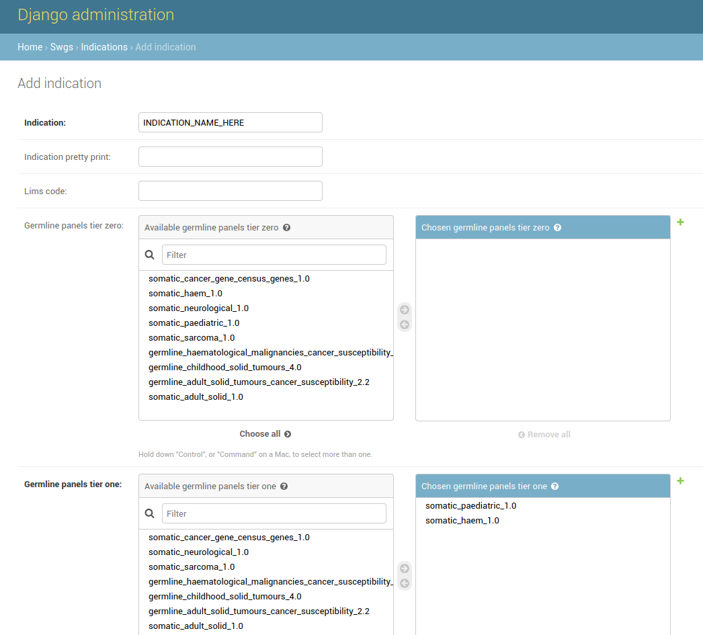

# SWGS Setup Guide

## Before You Start
Ensure you have followed the instructions in [Quick start guide](https://awgl.github.io/somatic_db/developer_guide/quick_install/) to set up the SVD application.

## Setting Up The Database
The  models for the SWGS application should have been created when setting up SVD. If they have not, or if you're adding SWGS to an existing instance, run:
```
python manage.py makemigrations swgs
python manage.py migrate
```
You should then load the initial setup fixtures
```
python manage.py loaddata swgs/fixtures/setup_fixtures.json
```

To set up initial germline panels, run the following:
```
python manage.py update_panels_from_panelapp
```

To set up initial somatic panels, run the following:
```
python manage.py update_panels_from_csv --panel_csv swgs/panels/somatic_panels/*.csv
```

## Setting Up Indications
Set up indications by going to the Django admin page and adding new indications from within the Indications model. Panels can be added and removed through selecting them and using the arrows in the widget.

